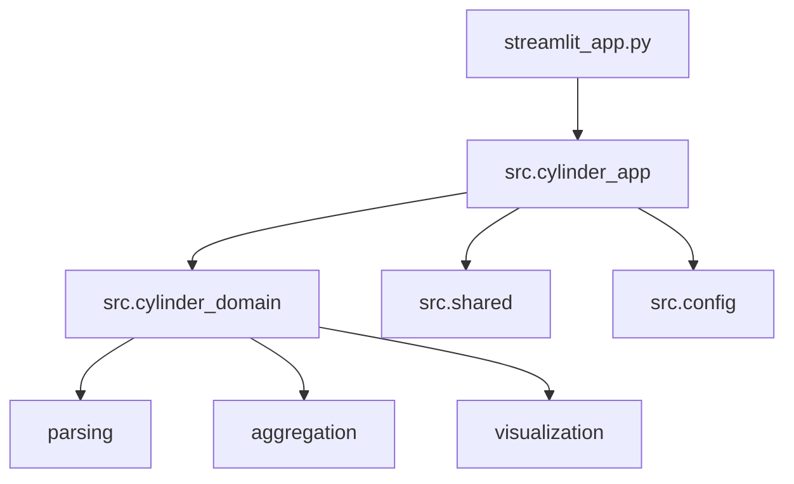

# Streamlit Time Series Visualization App

A Streamlit web application for uploading, filtering, and visualizing time series machine equipment data by device, module, and item.

## Features
- Upload CSV/Excel files
- Parse measurement columns named as `Module/Item/Variant` (multi-word variants supported)
- Filter by Machine No / Device SN, Module, and Item
- Aggregate hourly data into daily summaries (max, min, average, count, range)
- Plot multiple variants per Module+Item with threshold lines
- Interactive charts (zoom, pan, tooltips)

## Setup

### 1. Create environment and install dependencies
```powershell
python -m venv .venv
.venv\Scripts\Activate.ps1
pip install -r requirements.txt
pip install -e .
```

### 2. Run the app
```powershell
streamlit run streamlit_app.py
```

For a repo-local Windows launcher:

```powershell
run_app.bat
```

## Build Windows EXE

Use the PowerShell helper to create a single-file executable for non-technical users.

```powershell
# From repo root
scripts/build_exe.ps1

# Optional: clean previous build artifacts first
scripts/build_exe.ps1 -Clean
```

Output: `dist/CylinderViz.exe`. Double-click it to launch; your default browser opens at http://localhost:8501 where users can upload their CSV/Excel.

Tip: You can also run the launcher directly without packaging for a quick check:

```powershell
python scripts/app_launcher.py
```

## Troubleshooting
- Logs: Check `logs/app/` for daily app logs like `app_YYYYMMDD.log` and `logs/usage/` for the append-only usage snapshot file.
- Analytics state: Usage tracking uses the repo-local `logs/usage/usage_log_2026-05-15.txt` file. Each browser session appends a session snapshot, and the file is reloaded on app start so pageviews persist across restarts.
- Port busy: Change the port in [scripts/app_launcher.py](scripts/app_launcher.py#L63-L74) and rebuild, or stop the process using 8501.
- Antivirus: Some AV tools flag PyInstaller onefile EXEs. Code-signing and/or excluding the file may be needed in corporate environments.

## Notes
- Ensure your dataset includes an identifier (e.g., `Machine No` or `Device SN`) and a datetime column.
- Measurement columns must follow `Module/Item/Variant` naming.
- Thresholds are calculated relative to averaged daily values per variant.

## Project Structure

Top-level folders are grouped by purpose to keep root clean and predictable:

- `src/`: application and domain code
- `assets/`: static UI and packaging assets (`custom.css`, icons, images, splash)
- `scripts/`: developer tooling (launcher, build helper, smoke utility)
- `qa_automation/`: QA smoke test scripts and docs
- `tests/`: unit tests
- `data/`: local sample/input datasets (ignored in git)
- `logs/app/`: daily app runtime logs (ignored in git)
- `logs/usage/`: append-only analytics usage snapshots (ignored in git)
- `notebooks/`: exploratory notebooks (ignored in git)
- `examples/`: local scratch examples (e.g., temporary Streamlit snippets)
- `archive/`: local backups/snapshots (ignored in git)

Keep entry files in root (`streamlit_app.py`, `run_app.bat`, `README.md`, `pyproject.toml`) and avoid adding generated artifacts there.

## Modular Architecture

The codebase is organized with domain modules in `src/cylinder_domain` and generic shared utilities in `src/shared`.

- `src/cylinder_domain/parsing/column_detection.py`: ID and datetime column detection logic
- `src/cylinder_domain/parsing/schema.py`: parsing dataclasses and hierarchy builders
- `src/cylinder_domain/parsing/parsing.py`: high-level dataset parsing orchestration
- `src/cylinder_domain/aggregation/aggregation.py`: daily aggregation and baseline calculation
- `src/cylinder_domain/aggregation/thresholds.py`: threshold and variant-family business rules
- `src/cylinder_domain/aggregation/variant_planning.py`: variant grouping and Motion Time column resolution
- `src/cylinder_domain/visualization/visualization.py`: Plotly figure construction

- `src/shared/data_io.py`: uploaded file readers
- `src/shared/assets.py`: text/binary asset loaders
- `src/shared/dataframe_styles.py`: dataframe style helpers
- `src/shared/view.py`: Streamlit rendering helpers composed from utility modules

### Package Diagram



### Dependency Direction

- UI code in `src/cylinder_app` should depend on `cylinder_domain` and `shared`.
- `cylinder_domain` stays Streamlit-free and focused on domain logic.
- `shared` low-level modules should not depend on UI modules.

### Run Tests

```powershell
pytest -q
```

### QA Automation (Streamlit Smoke)

Use the dedicated QA scripts in [qa_automation/README.md](qa_automation/README.md) to run an automated Streamlit health smoke check.

```powershell
qa_automation/run_qa.ps1
```

### Packaging Notes

- `pyproject.toml` defines minimal build metadata and test discovery.
- `src/__init__.py` makes the `src.*` import path explicit.
- `run_app.bat` launches the current repo checkout instead of using a machine-specific absolute path.
